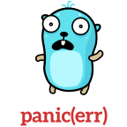

<div align="center">

</div>

[](http://golang.org)

[](https://goreportcard.com/report/github.com/ainsleyclark/errors)
[](https://codeclimate.com/github/ainsleyclark/errors/maintainability)
[](https://github.com/ainsleyclark/errors/actions/workflows/test.yml)
[](https://codecov.io/gh/ainsleyclark/errors)
[](https://pkg.go.dev/github.com/ainsleyclark/errors)

# Errors

A drop-in replacement for Go errors, with some added sugar! Error handling in Go made easy with codes, messages and
more. Failure is your domain!

## Overview

- ✅ Multiple mail drivers for your needs or even create your own custom Mailer.
- ✅ Direct dependency free, all requests are made with the standard lib http.Client.
- ✅ Send attachments with two struct fields, it's extremely simple.
- ✅ Send CC & BCC messages.
- ✅ Extremely lightweight.

## Why?

Errors are as important in your domain and application as the entities such as a User or Database. They should be
treated as individual types. Not only do they give a clear meaning to the users of the application if something goes
wrong, they can save hours of debugging time when used effectively.

Coupled with consistent and effective use of a logging package, we are able to tell if something goes wrong, where it
went wrong, how it went wrong and.

## How to use

See below on some common examples on how to use the error package.

### The Error Type

The `Error` struct below describes an application error thats returned when using the `New...()` constructors such
as `NewInternal()`. See bwlo on more detail on what each field contains.

```go
// Error defines a standard application error.
type Error struct {
	// The application error code.
	Code string `json:"code" bson:"code"`
	// A human-readable message to send back to the end user.
	Message string `json:"message" bson:"message"`
	// Defines what operation is currently being run.
	Op string `json:"operation" bson:"op"`
	// The error that was returned from the caller.
	Err error `json:"error" bson:"err"`
}
```

### Returning

Below is an example of returning a formatted `Error` type in a database call for obtaining a singular user. If no rows
are found, we return a `NOTFOUND` code. Likewise if there was an error executing the SQL query, we return a `NOTFOUND`
code with user-friendly messages.

```go
func (s *UserStore) Find(ctx context.Context, schema string, id int64) (core.User, error) {
	const op = "UserStore.Find"

	q := "SELECT from users WHERE ID = ? LIMIT 1"

	var out core.User
	err := s.DB().GetContext(ctx, &out, q.Build(), id)
	if err == sql.ErrNoRows {
		return core.User{}, errors.NewNotFound(err, fmt.Sprintf("Error obtaining User with the ID: %d", id), op)
	} else if err != nil {
		return core.User{}, errors.NewInternal(err, "Error executing SQL query", op)
	}

	return out, nil
}
```

### Output

Let's assume that an SQL error occurred during the execution of the query and no rows were returned. Without any context
of the error, we simply get:

```
syntax error near SELECT
```

However, by calling `err.Error()` on our wrapped error, it will return:

```
<internal> /Users/me/project/store/users.go:27 - UserStore.Find: syntax error near SELECT, Error executing SQL query
```

Now we know exactly where the error occurred, why it occurred and what file line and method.

### Checking Types

The package comes built in with handy functions for obtaining messages, codes and casting to the Error type, see below
for some examples.

#### To Error

```go
e := errors.New("error")
err := errors.ToError(e)
```

#### Obtaining a message

```go
err := errors.NewInternal(errors.New("error"), "My Message", "Operation")
msg := errors.Message(err)
fmt.Println(msg) // Output - "My Message"
```

#### Obtaining an error code

```go
err := errors.NewInternal(errors.New("error"), "My Message", "Operation")
code := errors.Code(err)
fmt.Println(code) // Output - "internal"
```

## Available Error Codes

Below is a list of available error codes within the errors package. It's tempting to build fine-grained error codes, but
it's a lot easier to manage more generic codes. The codes below are a good start to set off on, if you feel there is one
missing, please open a [pull request](https://github.com/ainsleyclark/errors/pulls).

| Code            | Value                | Notes                          |
|-----------------|:---------------------|:-------------------------------|
| CONFLICT        | `"conflict"`         | An action cannot be performed. |
| INVALID         | `"invalid"`          | Validation failed.             |
| NOTFOUND        | `"not_found"`        | Entity does not exist.         |
| UNKNOWN         | `"unknown"`          | Application unknown error.     |
| MAXIMUMATTEMPTS | `"maximum_attempts"` | More than allowed action.      |
| EXPIRED         | `"expired"`          | Subscription expired.          |

## Benchmarks

Ran on 19/05/2022

```bash
$ go version
go version go1.18.1 darwin/amd64

$ go test -benchmem -bench .
goos: darwin
goarch: amd64
pkg: github.com/ainsleyclark/errors
cpu: AMD Ryzen 7 5800X 8-Core Processor
BenchmarkNew-16                          1000000              1026 ns/op            1320 B/op          6 allocs/op
BenchmarkNewInternal-16                  1000000              1023 ns/op            1320 B/op          6 allocs/op
BenchmarkError_Error-16                  6582385               180.6 ns/op           464 B/op          4 allocs/op
BenchmarkError_Code-16                  637953824                1.883 ns/op           0 B/op          0 allocs/op
BenchmarkError_Message-16               628838649                1.906 ns/op           0 B/op          0 allocs/op
BenchmarkError_ToError-16               705541435                1.699 ns/op           0 B/op          0 allocs/op
BenchmarkError_HTTPStatusCode-16        1000000000               0.6282 ns/op          0 B/op          0 allocs/op
```

## Contributing

Please feel free to make a pull request if you think something should be added to this package!

## Credits

Shout out to the incredible [Maria Letta](https://github.com/MariaLetta) for her excellent Gopher illustrations.

## Licence

Code Copyright 2021 Go Mail. Code released under the [MIT Licence](LICENSE).
